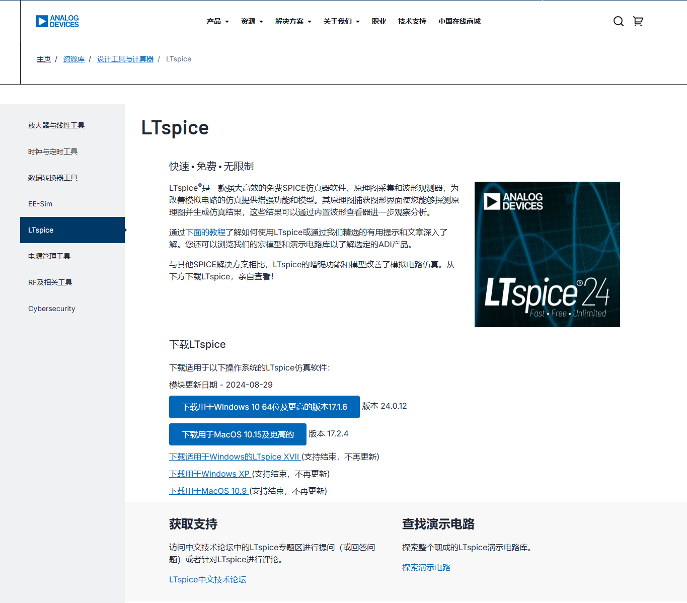

# 实验0 LTspice工具的安装和使用
“工欲善其事，必先利其器”

——《论语·卫灵公》，孔子

一个合适的工具对于我们的学习至关重要，在本系列实验开始之间，我们首先需要安装我们的仿真软件LTspice，LTspice是完全免费的，大家可以从LTspice的官网下载，就在最近（2024/8/29）LTspice更新了全新的版本24，这个版本的界面共更加“酷炫”了，快捷键也更加“人性化”了。
## 0.1. LTspice工具的安装
LTspice的安装异常简单，我相信大家都可以正常安装的。。。官方网址如下：https://www.analog.com/cn/resources/design-tools-and-calculators/ltspice-simulator.html

## 0.2. LTspice工具的使用
这部分内容网络上有非常多的学习资料，请大家自行STFW，这里推荐2个B站大学的系列教程（虽然使用的是老版本的LTspice，但是基本操作基本相同）：
【LTspice电路仿真从入门到精通、LTspice视频教程、LTspice中文教程】 https://www.bilibili.com/video/BV1Sy4y1m73e/?share_source=copy_web&vd_source=aa85303f1dbb0801d8c8b1ab5be44e98
【1_LTspice--简介(一)】 https://www.bilibili.com/video/BV1Yh411176J/?share_source=copy_web&vd_source=aa85303f1dbb0801d8c8b1ab5be44e98
## 0.3. LTspice工具的使用补充
虽然上述的2个教程非常优秀，内容也非常全面。但是有些内容还是没有涉及到，尤其是关于集成电路设计方面的一些使用小技巧，这里我单独补充一下。这些技巧也可以等到进行实验的时候再来学习。
### 0.3.1. 快速更改晶体管的尺寸
如下图所示，我们可以通过鼠标右键单击MOS模型，在弹出的对话框中可以直接编辑晶体管的各个参数（L表示沟道长度，W表示沟道宽度，AD表示漏级面积，AS表示源极面积，PD表示漏级周长，PS表示源极周长），计算机专业的同学对这些参数不了解不妨碍实验。LTspice会优先使用这里的值，也就是说这里的更改会覆盖例如.MODEL命令中定义的值。

### 0.3.2.通过原理图自定义元件
有时我们希望将自己画好的电路图定义为一个模块。
+ 首先我们新建一个原理图并绘制电路，注意，这里的电路只包括元器件（电阻，电容，晶体管等等），不能包含电源这类器件。
+ 然后，我们将输入信号，输出信号，以及电源和地信号都是用标签标注（名称自取）。注意，地信号也需要使用标签，不可以用“三角形”符号。

+ 绘制好后，点击左上角的Hierarchy-->Open this Sheet’s Symbol

+ 第一次点击会弹出对话框，表明没有找到文件，是否自动创建？选择是

+ 随后打开了创建元件符号的界面，这里可以看到，之前的标签已经显示出来了，我们可以根据我们的想法，点击左上角的Draw自己绘制一个合适的符号图形，比如反相器一般为一个三角形和一个圆圈。

+ 最后绘制好的反相器符号（其中InstName表示元件标号的位置）

+ 最后将原理图文件.asc和符号文件.asy另存为在到一个合适的地方，例如自己新建一个名为my_lib的文件夹，里面存放自己设计的一些电路。最终LTspice就是去找.asc文件和对应的.asy文件，从而形成一个完整的元件，所以请确保两个文件的名字相同。
### 0.3.3.添加元件库搜索地址
假设我们新建好了一个元件，当我们新建另一个工程的时候，就会发现LTspice找不到我们定义的元件了，这是因为我们没有告诉LTspice自定义元件的搜索地址，下面我们以刚刚定义的反相器元件为例来讲解添加搜索地址。
+ 我这里将反相器的原理图文件和符号文件另存为在了E:\LTspice\project\my_lib下，名字为inv_not_gate.asc和.asy

+ 点击Tools-->Settings，打开LTspice的设置界面

+ 在设置界面中，找到Search Paths选项卡，然后在下面的2个文本输入框中直接输入你存放模型的文件夹目录，上面的是符号寻找地址，下面的是库寻找地址，由于我们的原理图和符号文件存放在一起，所以都一样。

**注意，由于后续实验会使用到反相器和传输门的模型，因此请务必先把我存放在工程中的my_lib文件夹路径添加到LTspice的搜索路径目录中!**