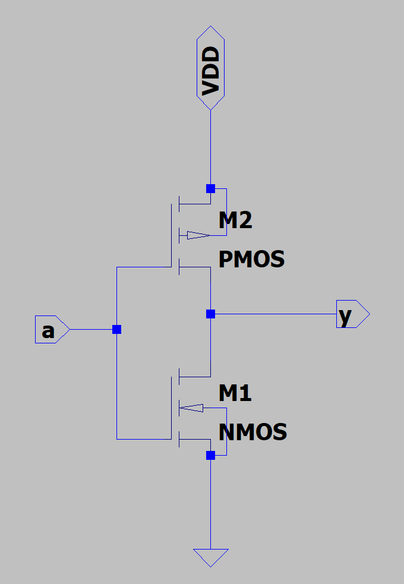
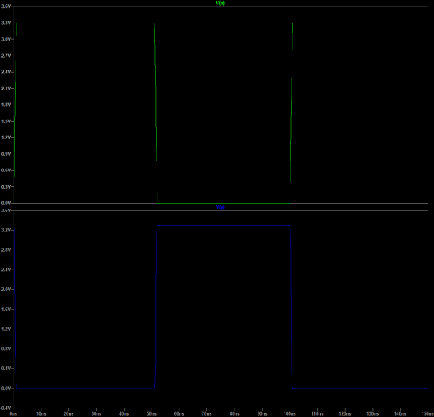
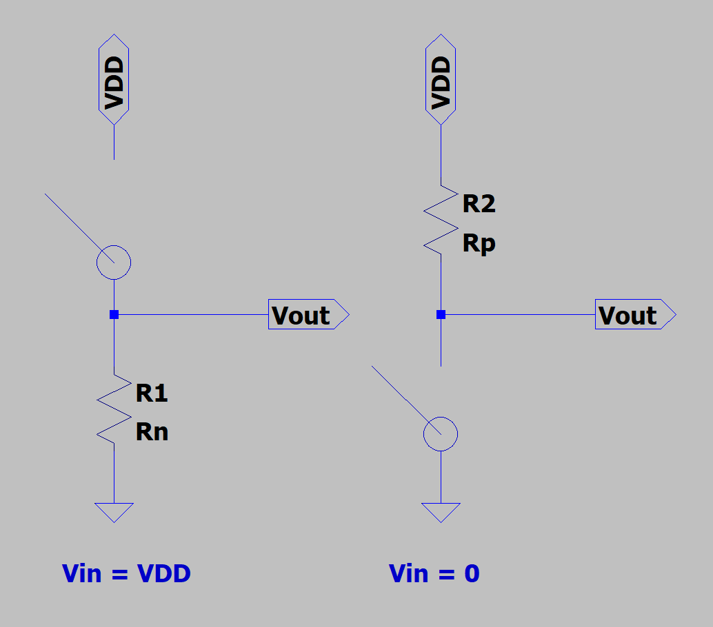
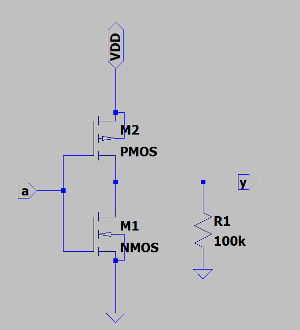
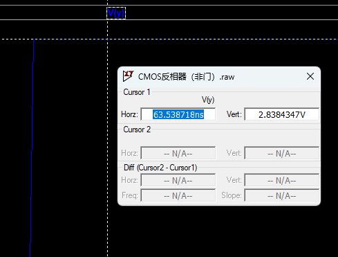
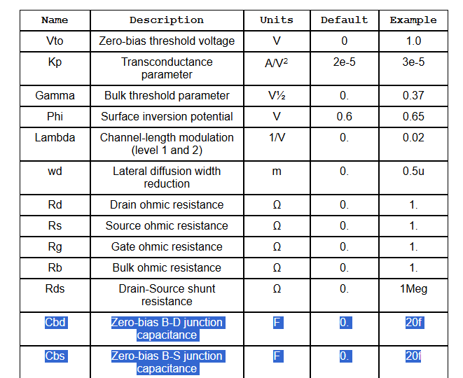
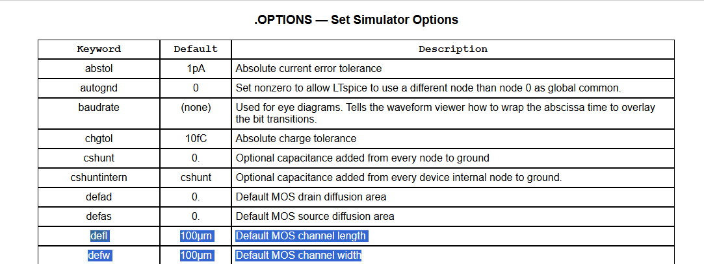

# 实验1CMOS反相器（非门）
“反者道之动；弱者道之用。”

——《道德经》，老子

反相器，或者说非门，是数字设计的核心。反相器设计是一个最基本的入门实验，类似于C语言编程中的“Hello World实验”，通过反相器的设计，我们可以一窥数字集成电路设计的流程与特点。
## 1.1.CMOS反相器电路设计
CMOS反相器由两个互补工作的MOS管组成，图 1展示了CMOS反相器的电路图，其中的VDD表示电源电压，输入信号为a，输出信号为y。



图 1 CMOS反相器电路图



图 2 CMOS反相器输出结果

其实我们可以使用MOS管的开关模型来直观的审视反相器电路的原理，如图 3所示。可以看到，当输入信号为VDD时：NMOS导通，PMOS关断。因此可以看作是PMOS的开关断开，NMOS变成一个电阻（为何NMOS变成一个电阻？而不是一个导线呢？思考一下，稍后会解答）。此时，输出通过“化身为”电阻的NMOS连接到GND，所以输出电压为GND。
同理，当输入信号为0V时：NMOS关断，PMOS导通。因此可以看作是NMOS的开关断开，PMOS变成一个电阻。此时，输出通过“化身为”电阻的PMOS连接到VDD，所以输出电压为VDD。可以看到，通过互补的NMOS和PMOS，我们实现了对输入信号的反相，也就是说我们实现了一个数字电路中的非门！恭喜，我们成功解锁了数字电路的第一个门——非门。



图 3 CMOS反相器的开关模型

## 1.2.晶体管等效导通电阻
问题引入：为何NMOS或者PMOS导通时视作电阻而不是导线呢？
我们不妨回想一下，我们可以将一个器件视作导线的基本假设是什么？是这个器件的电阻阻值非常小。你可能会问：“MOS管在导通时候的阻值不就应该很小吗？”可惜，事实并非如此，MOS管的导通等效电阻与供电电压、工艺参数等有关，具体可以通过下式进行计算（公式很长，不要害怕，了解即可）：

$$R_{eq} = \frac{1}{2} (\frac{VDD}{I_{DSAT}(1 + \lambda \cdot VDD)}) + \frac{VDD/2}{I_{DSAT}(1 + \lambda \cdot VDD/2)}) \approx \frac{3}{4} \frac{VDD}{I_{DSAT}} (1 - \frac{5}{6} \lambda  \cdot VDD)$$

其中，$I_{DSAT}$代表饱和电流，VDD表示工作电压，表示沟道调制系数。
一个0.25um CMOS工艺的NMOS和PMOS晶体管在导通时的电阻取值如下表所示：
**表 1 0.25um CMOS工艺（沟道长度为最小）的NMOS和PMOS晶体管（W/L = 1）的等效电阻Req**

| VDD（V） | 1 | 1.5	| 2	|2.5 |
|:---------:|:---:|:--:|:--:|:--:|
| NMOS（kΩ）| 35  | 19 | 15 | 13 |
| PMOS（kΩ）| 115 | 55 | 38 | 31 |

先不着急，我知道，现在的你很惊讶：晶体管在导通时候的阻值居然这么大？！
我们不妨来验证一下。我们让输入信号为低电平，输出信号为高电平。然后我们在输出端口连接一个阻值为100k的大电阻（此时电路相当于一个电阻分压模型）：如果晶体管导通时的电阻阻值和100k接近，那么输出的电压就会被晶体管等效导通电阻和输出电阻分压；如果晶体管导通时的电阻很小，那么相当于输出电压都被100k电阻“分走了”，那么输出电压变化应该不大。
结果不出所料，输出的高电压变为了2.8V（原始输出电压为3.3V），这说明有一部分电压被晶体管等效导通电阻“分走了”。



图 4 测试导通等效电阻电路图



图 5 输出高电平结果

## 1.3.故事时间：CMOS工艺
在微电子专业的保研面试中，经常出现的一道题就是：请你说一下CMOS工艺的英文以及中文含义。
CMOS工艺英文全称是Complementary Metal Oxide Semiconductor ，中文翻译为互补金属氧化物半导体。其中互补的含义就表示由NMOS和PMOS两个互补的器件来共同构成电路，例如在反相器中，我们就巧妙地利用了NMOS和PMOS互补的特性。
虽然这个互补的想法很符合我们的直觉，但是实际上，在20世纪70年代以及20世纪80年代早期，所有的早期处理器（例如大名鼎鼎的Intel4004）都是只用NMOS工艺实现的，因为当时的工艺缺少互补器件，这导致反相器会产生静态功耗（会带来功耗增加、发热等负面影响）。直到20世纪80年代后期，当工艺技术缩小到允许更高集成密度时，工业界不得不转向CMOS。
## 1.4.使用自己定义的MOSFET模型
虽然我们成功的实现了反相器的功能，但是我们不禁想问几个问题：1）这个仿真准确吗？2）我们使用的晶体管的工艺是多少节点呢？3）这个晶体管模型是不是过于理想？
关于LTspice中的MOSFET模型，请大家自行RTFM，点击LTspice的help，大家可以找到MOSFET的相关描述。在这里，我们着重关注以下几个指标：晶体管沟道长度（L），沟道宽度（W），寄生电容。通过阅读手册我们得知：在默认情况下1）晶体管沟道长度L和宽度W均为100um，2）晶体管的许多寄生电容均为0。



图 6 晶体管默认沟道长度和宽度



图 7 晶体管默认电容

这对于我们来说是十分不友好的。首先，因为目前绝大部分的工艺已经是深亚微米（沟道长度小于1um），先进工艺的等效沟道长度（**并非实际沟道长度**）甚至已经达到5nm以及3nm（例如GAA工艺），100um的工艺对于我们来说有些过于“落后”了。其次，我们在接下来的“旅途”中，会遇到很多电路正是利用了晶体管的某些寄生电容才可以实现正常的功能（例如动态逻辑就是利用了晶体管的寄生电容），所以默认的模型不仅结果过于理想，不准确，甚至会使得我们许多电路的功能无法正常仿真。
因此，我这里为大家提供了一个**简单的，粗略的，仅供本次教学使用**的MOSFET模型（**注意，该模型依然不准确，只是可以满足本次实验，仅供教学！！！**）。请将以下SPICE代码，存放到一个txt文档中，今后如无特殊声明，实验中使用的晶体管模型均为我们自己定义的模型！

```
.MODEL mynmos NMOS
+L=0.25u W=0.25u Ad=6.25e-14 As=6.25e-14 Pd=0.75u Ps=0.75u
+Vto=0.43 Kp=115e-6 Gamma=0.4 Lambda=0.06
+Cbd=0.1f Cbs=0.1f Cgso=3.11e-10 Cgdo=3.11e-10 Cgbo=0.1f Cj=2e-4 Cjsw=0.28e-9

.MODEL mypmos PMOS
+L=0.25u W=0.75u Ad=6.25e-14 As=6.25e-14 Pd=0.75u Ps=0.75u
+Vto=-0.4 Kp=30e-6 Gamma=-0.4 Lambda=-0.1
+Cbd=0.1f Cbs=0.1f Cgso=2.68e-10 Cgdo=2.68e-10 Cgbo=0.1f Cj=1.9e-4 Cjsw=0.22e-9
```

该模型是以教材中的0.25um CMOS工艺为参考的粗略模型，其中每一个参数的含义请大家自行RTFM（需要注意的是SPICE中晶体管的跨导Kp均为正值）。如果大家想要教材中的LEVEL-49模型，请大家访问教材的配套网址（http://icbook.eecs.berkeley.edu）进行下载，或者我也在工程文件夹中的cmos25_level49_lib文件夹中存放了。（注意，LTspice似乎并不支持LEVEL-49模型，因此无法直接使用该模型，因此我才自定义了上述的简单模型）
## 1.5.构建自己的电路模块库
在我们构建大规模集成电路的时候，很多模块都会复用，这一点对于使用HDL语言的同学一定不会陌生（例如Verilog就是由一个一个module构成）。因此，我们一般会把反相器这样的基本单元进行封装，从而构建自己的电路模块库。
请你通过STFW的方式将反相器封装为一个电路模型，注意，使用我们自己定义的mynmos和mypmos模型！并在其他文件中试着调用。
## 1.6.动手实验内容
1. 请仿真反相器的电压传输特性曲线（VTC），即展示Vout和Vin之间的关系。
提示：使用LTspice的dc扫描功能。
2. 并想想曲线不同部分NMOS和PMOS分别处于什么工作区。（需要半导体物理与器件等相关知识）
3. 试着改变我们定义的MOSFET中的各个参数，观察变化后的实验结果。并从半导体物理的角度解释为什么。